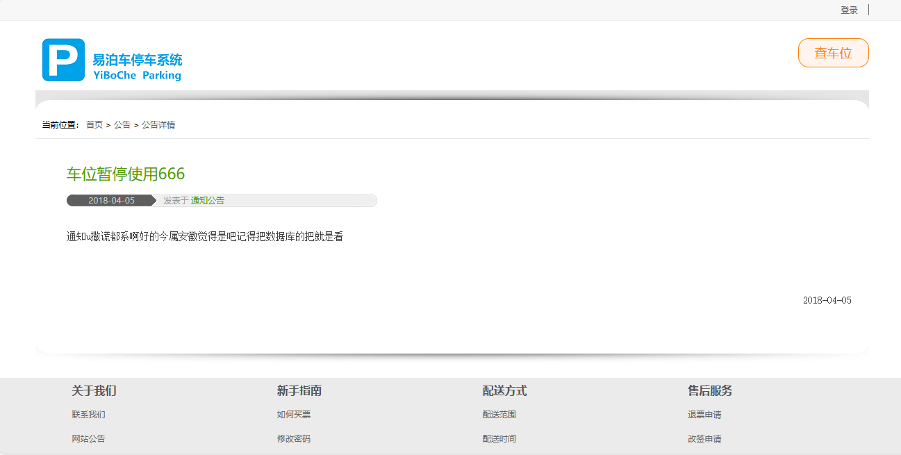
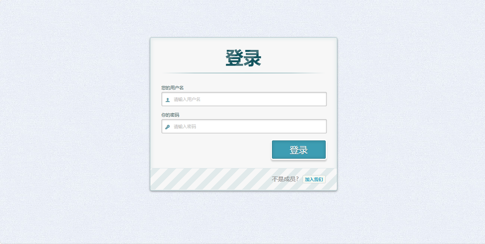
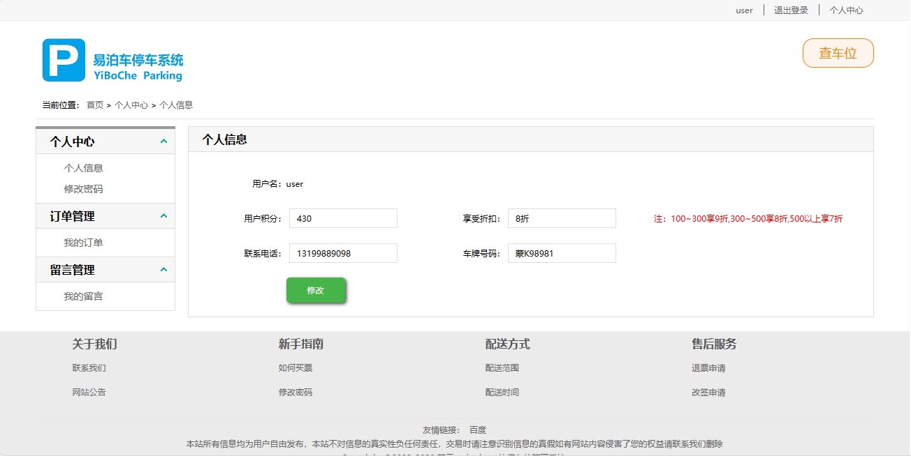
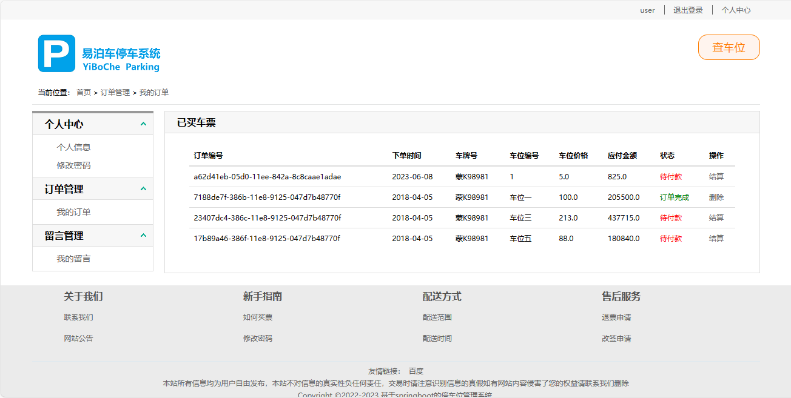

<h1 align="center">基于springboot的停车位管理系统</h1>

- <b>完整代码获取地址：从戎源码网 ([https://armycodes.com/](https://armycodes.com/))</b>
- <b>技术探讨、资料分享，请加QQ群：692619798</b> 
- <b>作者微信：19941326836  QQ：952045282</b> 
- <b>承接计算机毕业设计、Java毕业设计、Python毕业设计、深度学习、机器学习</b>
- <b>选题+开题报告+任务书+程序定制+安装调试+论文+答辩ppt 一条龙服务</b>
- <b>所有选题地址 ([https://github.com/YuLin-Coder/AllProjectCatalog](https://github.com/YuLin-Coder/AllProjectCatalog)) </b>

## 项目介绍

基于springboot的停车位管理系统：前端 thymeleaf、Jquery、bootstrap，后端 Springboot、Mybatis，系统角色分为：用户、管理员，管理员在管理后台录入车位信息，用户在线查找车位、预约车位，解决停车找车位烦恼；主要功能如下：

### 用户：

- 基本功能：登录、注册、安全退出、密码修改、个人信息修改
- 首页：广告轮播图、最新公告、快捷链接入口
- 核心功能：查车位、车位列表展示、车位搜索筛选、车位详情、地图定位、车位预约、我的订单、在线结算付款
- 次要功能：我的留言、我要留言、公告详情

### 管理员：

- 信息发布管理：公告列表、关键词搜公告、添加公告、公告编辑、公告删除
- 车位管理：车位列表、关键词搜车位、添加车位、车位信息编辑、车位信息删除、高德地图定位车位
- 订单管理：订单列表、关键词搜订单、订单删除
- 积分排行：积分排行榜、根据名称搜索
- 投诉建议管理：关键词搜索、留言列表、留言回复、留言删除
- 系统管理：管理员列表、添加管理员、管理员删除、关键词搜索、用户列表、用户启用、用户停用

## 环境

- <b>IntelliJ IDEA 2009.3</b>

- <b>Mysql 5.7.26</b>

- <b>Tomcat 7.0.73</b>

- <b>JDK 1.8</b>

## 运行截图

